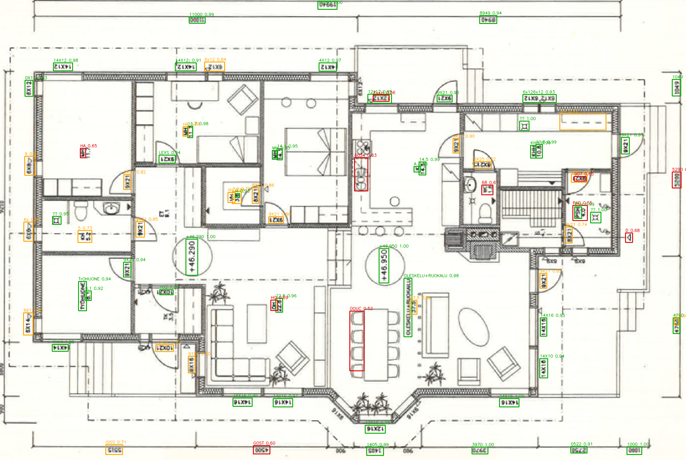

# TakeoffLens

Blueprint analysis: upload an architectural floor plan, extract rooms, dimensions and areas
with OCR + LLM, and review the results with bounding-box overlays.

> **Status: Phase 1.** Ingest, preprocessing and OCR run from the CLI. Dimension parsing,
> LLM extraction, API routes, viewer and eval land in later phases. This README is replaced with the full write-up in Phase 7. No accuracy numbers
> appear here until they have actually been measured.

## Quick start

```bash
cp .env.example .env    # then edit: OPENAI_API_KEY, DATASET_DIR, DATASET_COCO_DIR
docker compose up --build
```

- API: http://localhost:8000/health
- Web: http://localhost:3000

`/health` reports database connectivity and whether the CubiCasa5K dataset mount is present,
so a misconfigured `DATASET_DIR` fails loudly at startup instead of deep inside an eval run.

## Data findings

Four things about CubiCasa5K that shaped the design. All were measured, not assumed.

### 1. The COCO annotations have no doors or windows
The supplied COCO files contain exactly two categories, `wall` and `room`, across all three
splits (train 173023 annotations, val 15926, test 16818). A room/door/window detector cannot
be trained from them as-is. `model.svg` does carry `Door Swing *` and `Window *` geometry, so
Phase 8 generates door/window boxes from the SVGs and trains on the 4-class union — with the
conversion as its own verified step.

### 2. Room labels carry an area, not a width x length
Finnish plans print a single figure under the room label — `MH 11.7` is an 11.7 m² bedroom.
The `width x length` metric pairs exist only inside `model.svg`, where they are
`display: none` and are never rendered into the page image. So `area_m2` is the primary
extracted field, and `width_m`/`length_m` stay null unless a pair is genuinely printed. They
are never derived from an area.

### 3. `9X21` is not a dimension
Finnish door and window size codes (`9X21`, `14X12`, `8X21`) appear all over architectural
plans and look exactly like a `width x height` pair. They are the dimension parser's main
false-positive source and are classified and excluded explicitly.

### 4. Decimal separators vary
Finnish convention is the comma (`12,5 m²`), but the architectural plans inspected so far
print a period (`MH 11.7`) and `90 M2`. The parser accepts both, and Tier 1 reports which
actually dominates rather than assuming.

### The three folders are different documents

| Folder | test split | Room labels | Areas / dimensions |
| --- | --- | --- | --- |
| `high_quality_architectural` | 270 | Finnish abbreviations | often, inconsistently |
| `high_quality` | 63 | Finnish abbreviations | rarely |
| `colorful` | 67 | none | none |

`colorful` pages are CubiCasa vector renders carrying only the boilerplate
"SUUNTAA-ANTAVA, EI MITTAKAAVASSA" and a logo — a legitimate negative set for OCR. Only
`high_quality_architectural` can support a dimension metric, so the LLM runs and accuracy
metrics are scoped to it.

### `model.svg` scale is a constant 100 units = 1 metre
Validated over 5127 room edges across 200 test plans: median ratio 100.02. The ~7% of edges
that deviate are L-shaped rooms whose bounding box is not the nominal labelled dimension, not
a change in scale. Room area is therefore the shoelace area of the `Space` polygon / 10000,
which agrees with the areas printed on the drawings to within ~1-2%.

That makes automatic room type/count/area ground truth available for the whole dataset for
free, and lets the hand-labelling helper pre-fill every room. Automatic ground truth is
labelled as such everywhere it is used and never described as hand-verified.

## OCR on rotated plans

Room labels on these plans are frequently set at 90 degrees. A single upright OCR pass
recovers almost nothing, and on vertical text PaddleOCR often picks the wrong 180-degree flip
and returns confidently mirrored readings (`9X21` as `IZX6`, `KHH` as `HHM`).

The pipeline OCRs each page at 0/90/180/270, maps every box back to original page coordinates
and merges, keeping the highest-confidence reading among overlapping boxes. On the smoke-test
plan the orientation passes contributed 5 / 29 / 30 / 15 tokens respectively — the upright
pass alone would have found 5.



Boxes are coloured by confidence: green >= 0.9, amber 0.7-0.9, red below. Regenerate with:

```bash
docker compose run --rm --no-deps api python -m app.pipeline.run   /data/cubicasa5k/high_quality_architectural/1191/F1_scaled.png   --debug-image /app/_debug/ocr_1191.png
```

## Dataset

CubiCasa5K is **not** vendored into this repo. Set `DATASET_DIR` and `DATASET_COCO_DIR` to the
host paths in `.env`; docker-compose mounts both **read-only** into the api container at
`/data/cubicasa5k` and `/data/cubicasa5k_coco`. See [eval/README.md](eval/README.md).

## Pipeline CLI

```bash
docker compose run --rm --no-deps api python -m app.pipeline.run <path> [options]
```

| Option | Purpose |
| --- | --- |
| `--debug-image PATH` | Write the page with token boxes drawn |
| `--json PATH` | Write tokens as JSON |
| `--orientations 0,90,180,270` | Which rotations to OCR and merge |
| `--min-confidence 0.5` | Drop tokens below this confidence |
| `--dpi 300` | PDF render DPI |
| `--grayscale --denoise --adaptive-threshold --deskew --upscale` | Preprocessing toggles, all off by default |

Preprocessing defaults are off because a measured sweep on a CubiCasa architectural plan
found the raw image best; adaptive threshold in particular is actively harmful on scanned CAD
drawings, where it welds thin label strokes to the surrounding wall hatching. The toggles
exist so Phase 6 can ablate them. Reasoning is documented in
[api/app/pipeline/preprocess.py](api/app/pipeline/preprocess.py).

## Local development (without Docker)

```bash
cd api
python -m venv .venv && .venv/Scripts/pip install -r requirements.txt
.venv/Scripts/python -m pytest
.venv/Scripts/python -m ruff check .
```

Note: `paddlepaddle` publishes CPU wheels for linux/amd64 only, so the container is pinned to
that platform. On Apple Silicon it builds under emulation.

## Layout

| Path | What |
| --- | --- |
| `api/` | FastAPI service, CV/OCR pipeline, Alembic migrations |
| `web/` | Next.js App Router frontend |
| `eval/` | Tiered evaluation harness and ground truth |

See [CLAUDE.md](CLAUDE.md) for the full build spec.
