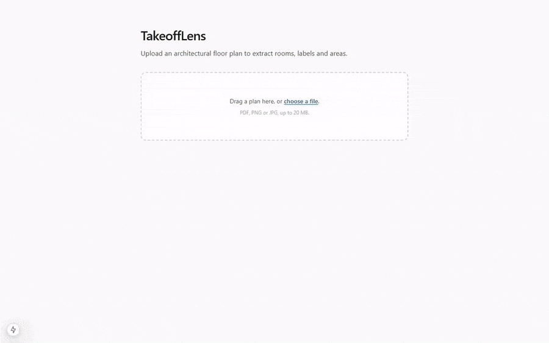
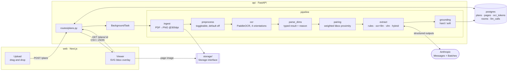

# TakeoffLens

Blueprint analysis: upload an architectural floor plan, extract rooms, dimensions and areas
with OCR + LLM, and review the results with bounding-box overlays.

> **Status: end to end and evaluated.** Pipeline, four extraction approaches, API,
> background processing, export and the web viewer all work; the evaluation has been run and
> its numbers are below. A local detector (Phase 8) is not started.
>
> **Every number in this README was measured by a script in `eval/`, and each one says what
> it was measured against.** The evaluation is fully automatic — it reproduces from the
> dataset and the cached results with no human labelling step. Where a metric has a known
> weakness, the weakness is stated next to it rather than in a footnote. Nothing here is
> estimated or illustrative.



*Real run, no mock-ups. The OCR wait is time-compressed — see [Demo](#demo).*

## Quick start

```bash
cp .env.example .env    # then edit: ANTHROPIC_API_KEY, DATASET_DIR, DATASET_COCO_DIR
docker compose up --build
```

- API: http://localhost:8000/health
- Web: http://localhost:3000

`/health` reports database connectivity and whether the CubiCasa5K dataset mount is present,
so a misconfigured `DATASET_DIR` fails loudly at startup instead of deep inside an eval run.

### Using the viewer

Drop a PDF, PNG or JPG on the upload page. The page polls until the job reaches a terminal
state, then opens the viewer: the page image with overlays on the left, the extracted rooms
on the right.

- **Approach toggle** — one button per extraction approach that actually produced rooms for
  that page (`rules`, `ocr+llm`, `vlm`, `hybrid`). The interactive upload path runs whatever
  `PIPELINE_APPROACHES` is set to, so a default install shows only `rules`; the buttons are
  built from the data rather than hardcoded, so they follow that setting.
- **OCR boxes** — toggles all OCR tokens, which is how you tell "the model misread it" apart
  from "OCR never saw it". On these plans that distinction is most of the error budget.
- **Hover** — hovering a table row highlights its box on the page, and vice versa.
- **Ungrounded rooms** are shown with a red box and a badge rather than hidden. A claim that
  could not be tied back to a token is the thing a reviewer most needs to see.
- A dash in the table means the value was **not printed on the page**. Width and length stay
  empty unless the drawing prints a `w × l` pair; they are never derived from an area.

> **Windows and macOS note:** a bind mount does not deliver inotify events, so the Next
> dev server would never notice a host edit. `WATCHPACK_POLLING=true` is set on the `web`
> service in `docker-compose.yml` to make it poll instead, and hot reload works normally.
> If you ever see edits not taking effect, check that variable first.

## Architecture



Processing runs as a FastAPI `BackgroundTask`. That is the right size for a demo and the
wrong size for production — see [Scaling](#scaling-what-would-change). Page images go through
a `Storage` interface rather than direct filesystem calls, so S3 is a swap rather than a
rewrite.

## Data findings

Four things about CubiCasa5K that shaped the design. All were measured, not assumed.

### 1. The COCO annotations have no doors or windows
The supplied COCO files contain exactly two categories, `wall` and `room`, across all three
splits (train 173023 annotations, val 15926, test 16818). A room/door/window detector cannot
be trained from them as-is. `model.svg` does carry `Door Swing *` and `Window *` geometry, so
Phase 8 generates door/window boxes from the SVGs and trains on the 4-class union — with the
conversion as its own verified step.

### 2. Room labels carry an area, not a width x length
Finnish plans print a single figure under the room label — `MH 11.7` is an 11.7 m² bedroom.
The `width x length` metric pairs exist only inside `model.svg`, where they are
`display: none` and are never rendered into the page image. So `area_m2` is the primary
extracted field, and `width_m`/`length_m` stay null unless a pair is genuinely printed. They
are never derived from an area.

### 3. `9X21` is not a dimension
Finnish door and window size codes (`9X21`, `14X12`, `8X21`) appear all over architectural
plans and look exactly like a `width x height` pair. They are the dimension parser's main
false-positive source and are classified and excluded explicitly.

### 4. Decimal separators vary
Finnish convention is the comma (`12,5 m²`), but the architectural plans inspected so far
print a period (`MH 11.7`) and `90 M2`. The parser accepts both, and Tier 1 reports which
actually dominates rather than assuming.

### The three folders are different documents

| Folder | test split | Room labels | Areas / dimensions |
| --- | --- | --- | --- |
| `high_quality_architectural` | 270 | Finnish abbreviations | often, inconsistently |
| `high_quality` | 63 | Finnish abbreviations | rarely |
| `colorful` | 67 | none | none |

`colorful` pages are CubiCasa vector renders carrying only the boilerplate
"SUUNTAA-ANTAVA, EI MITTAKAAVASSA" and a logo — a legitimate negative set for OCR. Only
`high_quality_architectural` can support a dimension metric, so the LLM runs and accuracy
metrics are scoped to it.

### `model.svg` scale is a constant 100 units = 1 metre
Validated over 5127 room edges across 200 test plans: median ratio 100.02. The ~7% of edges
that deviate are L-shaped rooms whose bounding box is not the nominal labelled dimension, not
a change in scale. Room area is therefore the shoelace area of the `Space` polygon / 10000,
which agrees with the areas printed on the drawings to within ~1-2%.

That makes automatic room type/count/area ground truth available for the whole dataset for
free, and lets the hand-labelling helper pre-fill every room. Automatic ground truth is
labelled as such everywhere it is used, and never described as anything stronger.

## OCR on rotated plans

Room labels on these plans are frequently set at 90 degrees. A single upright OCR pass
recovers almost nothing, and on vertical text PaddleOCR often picks the wrong 180-degree flip
and returns confidently mirrored readings (`9X21` as `IZX6`, `KHH` as `HHM`).

The pipeline OCRs each page at 0/90/180/270, maps every box back to original page coordinates,
clusters overlapping boxes and picks the best-supported reading from each cluster.

Choosing that reading by recogniser confidence does not work: on rotated text the recogniser is
confidently wrong (`LEXS` scored 0.943 against the correct `9X21` at 0.895). Readings are
instead ranked by, in order:

1. **Vocabulary** — does the reading match the Finnish room lexicon, or a valid area,
   dimension or door-code pattern? `9X21` scores; `IZX6` does not.
2. **Orientation plausibility** — a tall page-space box means vertical text, which the 90/270
   passes present upright to the recogniser. Used only to break ties.
3. **Confidence**, last.

Vocabulary must outrank orientation: `MH` is read correctly from the 180 pass on a tall box, so
a hard orientation filter would discard it. Measured across 6 architectural test plans, this
ranking raised room-label recall from **27/62 to 32/62**, with no plan regressing.

The orientation rule applies to tall boxes only. The mirror rule for wide boxes was tested and
rejected — it is wrong on real data, where `9X21` at `(1931,588)` is read correctly by the 90
pass while 0 and 180 give `1 ZX8` and `907`. It stays available as a config option purely so
the claim can be re-tested.

### Settings confirmed on a wider set

Re-measured across 6 `high_quality_architectural` test plans, varying one setting at a time,
against reference labels and areas from `model.svg`:

| Variant | Room labels | Areas (printed) | Time |
| --- | --- | --- | --- |
| **default — 4 rotations, 1536 det, no threshold** | **32/62** | **14/29** | 114s |
| 0° only | 16/62 | 4/29 | 27s |
| 0° + 90° | 25/62 | 10/29 | 53s |
| detection size 2400 | 26/62 | 5/29 | 172s |
| adaptive threshold on | 20/62 | 11/29 | 108s |

All three original choices held: four rotation passes beat one or two, the larger detection
size is worse *and* 50% slower, and adaptive threshold costs 12 room labels.

### Two area denominators, and why only one is honest

`model.svg` lists every annotated room, but its dimension labels are `display: none` and are
never rendered onto the page. Counting them as the denominator therefore counts areas that
were **never printed**, which understates recall badly:

| Denominator | Result | |
| --- | --- | --- |
| rooms in the SVG annotation | 16/89 (18%) | misleading |
| **areas actually printed on the page** | **14/29 (48%)** | hand-counted, [the real number](eval/ground_truth/printed_areas_6.json) |

Only 2 of the 6 plans print per-room areas at all. The other four carry a whole-apartment
summary (`4H K KH WC 90 M2`), hand-lettered labels, or nothing but elevations and door codes.

The same correction exposes 2 **spurious** area matches — numbers on plans that print no
areas which happened to land within 5% of a polygon area. Under the SVG denominator those
counted as successes.


Boxes are coloured by confidence: green >= 0.9, amber 0.7-0.9, red below. Regenerate with:

```bash
docker compose run --rm --no-deps api python -m app.pipeline.run   /data/cubicasa5k/high_quality_architectural/1191/F1_scaled.png   --debug-image /app/_debug/ocr_1191.png
```

## Dimension parsing

`parse_dims.parse()` returns a typed result — `area`, `dimension_pair`, `door_window_code` or
`unknown` — each carrying a reason, the matched format, and a plausibility flag.

| Input | Kind | Result |
| --- | --- | --- |
| `11,7 m²`, `11.7`, `90 M2` | `area` | `area_m2=11.7` |
| `MH 11.7` | `area` | `area_m2=11.7`, `label=MH`, `room_type=bedroom` |
| `3,5 x 4,2`, `3500 x 4200` | `dimension_pair` | `width_m=3.5`, `length_m=4.2` |
| `9X21`, `10x21`, `12X12` | `door_window_code` | excluded from room dimensions |
| `1:100`, `+46.290`, `2024`, `19940` | `unknown` | scale / elevation / year / mm wall run |
| `4H K KH WC 90 M2` | `unknown` | apartment summary, not a room |

Areas never invent a width and length, and pairs are never inferred from an area. Areas below
1 m² or above 500 m² are flagged rather than dropped.

The discriminator between `3500 x 4200` (millimetres) and `9X21` (a door code) is magnitude and
the decimal separator: a bare integer pair with both sides ≤ 30 is a Finnish decimetre door
code. `3 x 4` is genuinely ambiguous and is classified as a door code, since that is far more
common on these plans — `raw` is preserved so a later stage can override. 91 unit tests cover
this, including proof that door codes are never read as room dimensions.

## Extraction: three approaches, one schema

| Approach | Evidence given to the model | Citations | Cost |
| --- | --- | --- | --- |
| `rules` | none - OCR + parser + pairing, no model call | by construction | **$0** |
| `ocr+llm` | OCR tokens with ids and boxes, plus candidate label/area pairs | required | paid |
| `vlm` | the page image alone, downscaled | none | paid |
| `hybrid` | the page image **and** the OCR token list as hints | where used | paid |

`rules` is the baseline every paid approach has to beat. It is deterministic, instant and
free, so an LLM approach that does not clearly beat it is not earning its cost. It appears
in every results table for exactly that reason.

All three return the same Pydantic schema via Structured Outputs in strict mode, so the eval
comparison is about the evidence rather than three different pipelines.

Label/area pairing happens **before** the call, not inside it. On these plans the area sits
directly under its label, which is a geometric fact the model should not have to rediscover
from a flat token list — and if it did, there would be no way to check it. Candidate pairs
are computed by weighted bbox proximity (vertical distance counts for less than horizontal)
and passed as suggestions.

### Grounding

Hard for `ocr+llm` and `hybrid`: every cited token id must exist, and every non-null
`area_m2` must match an area the parser actually found in a token. Failures are counted as
hallucinations; the room is kept with `grounded=False` so it stays visible and countable
rather than quietly disappearing.

Soft for `vlm`: the same checks run and are reported, but nothing is dropped. The vision
model can legitimately read an area OCR missed — and on these plans OCR misses about half of
them — so failing a VLM room for disagreeing with OCR would measure OCR, not the model.

### Models and cost

Model IDs come from `ANTHROPIC_TEXT_MODEL` and `ANTHROPIC_VISION_MODEL`, never hardcoded.
The default is **`claude-haiku-4-5`** — the cheapest current model at **$1/$5 per MTok**,
vision-capable, so one model serves all three approaches
([checked 2026-09-17](https://platform.claude.com/docs/en/about-claude/models/overview)).
`claude-sonnet-5` ($2/$10) is a one-line step up if Haiku's recall proves insufficient.

Structured outputs go through `client.messages.parse(output_format=<Pydantic model>)`, which
constrains the response to the schema and returns a validated instance.

Two API details the client handles:

- **`max_tokens` is required**, and hitting it truncates the extraction mid-room. A
  `max_tokens` stop reason is treated as a failure rather than a usable result — a truncated
  room list looks exactly like a complete one.
- **Sonnet 5 and Opus 5 reject `temperature`** (the sampling parameters were removed);
  Haiku 4.5 still accepts it. `messages.parse()` doesn't expose it either, so when configured
  it rides in `extra_body`. The client detects a rejection from the API error, remembers it
  per model, and retries without it — rather than carrying a model list that goes stale.

Cost is never computed in pipeline logic. Every call logs its token counts to `llm_calls`,
and `eval/pricing.yaml` holds the rates with the date they were taken.

**Anthropic's token accounting differs from OpenAI's in a way that silently misreports cost
if ignored:** `input_tokens` *excludes* cached tokens, and cache reads and cache writes are
separate counters with their own rates (a read is 0.1x base input; a 5-minute write is
1.25x). The four counters are summed independently rather than netted.

### API keys

The key is read from the project `.env` file **and nowhere else** - never from the process
environment. `docker-compose.yml` does not pass `ANTHROPIC_API_KEY` through, and
`app/config.py` parses the mounted `.env` directly.

This is deliberate. The first cost-gate run in this project was paid for by an
`ANTHROPIC_API_KEY` that happened to be exported in the developer's shell, silently
overriding the placeholder in `.env`. A key that can be picked up by accident can be spent
by accident.

### Running the cost gate

```bash
# needs a real ANTHROPIC_API_KEY in .env
docker compose run --rm api python /eval/tier3_cost_probe.py --max-spend 1.00
```

`--max-spend` is a hard cap. Before each call it compares the running total (from logged
token costs) against the cap, using the most expensive page seen so far as the estimate, and
stops the run if the next call could exceed it. It is checked *before* the call, because
afterwards the money is already gone. The `rules` approach is never gated - it costs nothing.

### Tier 3 scope

Tier 3 is a **50-plan random sample** of the `high_quality_architectural` test split, drawn
with a fixed seed (`SAMPLE_SEED = 20260917`, recorded in `eval/tier3_cost_probe.py`) so the
plan set is reproducible and auditable:

```bash
docker compose run --rm api python /eval/tier3_cost_probe.py --sample 50 --max-spend 1.00
```

### Batch API

The full run uses the Message Batches API, billed at **50% of standard rates** on both input
and output. Latency becomes minutes rather than seconds, which is irrelevant for an eval
sweep and unacceptable for the interactive upload path - so batching lives in `app/batch.py`,
not in the request path.

Batch requests carry raw parameters rather than the `messages.parse` helper, so structured
output is requested with `output_config.format` and validated against the same Pydantic model
on the way back. Results are matched by `custom_id`, never by position.

### Image resolution

Image tokens scale with pixel count, so shrinking the page looks like an obvious lever.
`eval/resolution_sweep.py --dry-run` projects it arithmetically at no cost:

| Long edge | Image tokens | Est. $/page | vs 1536 |
| --- | --- | --- | --- |
| 1536 | 2,167 | $0.0066 | 100% |
| 1024 | 1,048 | $0.0055 | 83% |
| 768 | 589 | $0.0050 | 76% |
| 512 | 261 | $0.0047 | 71% |

**Resolution is a weak lever here.** Dropping to a quarter of the pixels saves only 24%,
because output tokens (~810 at $5/MTok) dominate the bill, not the image. Running the sweep
for real measures whether label recall survives each step - the cost case alone does not
justify the reduction.

Runs all three approaches over the 6 validation plans, reports labels found, areas found,
hallucinations, latency and measured cost per page, extrapolates the full 270-plan run, and
then stops. Responses are cached per (plan, approach), so a re-run costs nothing.

### Measured results - 6 plans, `claude-haiku-4-5`

| Approach | Labels | Areas (printed) | Spurious | Hallucinations | Mean latency | Cost/page |
| --- | --- | --- | --- | --- | --- | --- |
| **`rules`** | **36/62** | 7/29 | 4 | **0** | **0.0s** | **$0** |
| `ocr+llm` | 31/62 | 7/29 | 3 | 2 | 12.4s | $0.0062 |
| `vlm` | **37/62** | 3/29 | 0 | 2 | 8.6s | $0.0075 |
| `hybrid` | 32/62 | **8/29** | 3 | 2 | 18.3s | $0.0088 |

Total spend for the gate: **$0.135** across 18 calls.

**The free rules baseline is competitive.** It beats `ocr+llm` on labels, ties it on areas,
and sits one label behind the best paid approach - at zero cost, zero latency and zero
hallucinations. That is the most important number in this table, and the reason `rules`
appears in all of them.

Two caveats, both material:

- The `rules` row benefits from the pairing and parser fixes below; the three LLM rows are
  cached from **before** those fixes. Re-running them costs money and has not been done, so
  this comparison is not yet apples-to-apples and is marked as such wherever it appears.
- "Areas (printed)" counts only the 2 of 6 plans that print per-room areas. "Spurious" are
  matches on the 4 plans that print none.

The paid approaches still differ informatively: the vision model reads **labels** best (it
sees rotated text OCR mangles) but **areas** worst (the small figures under each label).
Adding OCR tokens back (`hybrid`) recovers areas at the cost of label recall and latency.

### Where area recall actually goes

A single "areas found" number hid three unrelated failures. `eval/funnel.py` walks each
printed area through the pipeline using only the OCR cache, so it costs nothing:

| Stage | Before fixes | After fixes |
| --- | --- | --- |
| printed on the page | 29/29 | 29/29 |
| OCR read the digits | 20/29 | 20/29 |
| parser called it an AREA | 18/29 | **20/29** |
| paired with a label | 12/29 | **16/29** |

Three real bugs, each found by the funnel rather than by guessing:

1. **Combined tokens paired with the wrong room.** `khh 6.8` is one OCR token carrying both
   label and area. It appeared in both the label list and the area list, was forbidden from
   matching itself, and so was paired with *another* room's area - a confidently wrong
   answer rather than a missing one. Ten of 26 tokens on one plan were of this form. Such
   tokens now pair with themselves.
2. **OCR near-misses were discarded.** `KEITTIO` came back as `keittlo` (I read as L) and was
   rejected as an unknown label, losing a real area. Labels of 5+ characters now tolerate a
   one-character slip; short dense abbreviations (`K`, `H`, `S`, `WC`) never do.
3. **Multi-word labels did not match.** OCR split `autovaja 19.5` into `autova ja 19.5`.

The remaining losses are upstream OCR, not logic: 9 areas whose digits OCR never read, and 3
on plan 1191 whose *labels* OCR never read, so there is nothing to pair with. Both are OCR
recall problems and are recorded as such rather than papered over.

## Results

All figures below come from a **50-plan random sample** of the 270 `high_quality_architectural`
test plans (seed `20260917`, reproducible). Total spend on the whole evaluation: **$0.54**.

### Room labels - automatic ground truth, all 50 plans

Reference is the Finnish name label in `model.svg`, 495 labels.

| Approach | Labels found | Grounding failures | $/page | Total |
| --- | --- | --- | --- | --- |
| `rules` (free baseline) | 246/495 | 0 | $0 | $0 |
| `ocr+llm` | 234/495 | 2 | $0.00299 | $0.1496 |
| **`vlm`** | **292/495** | **0** | $0.00368 | $0.1841 |
| `hybrid` | 289/495 | 10 | $0.00415 | $0.2076 |

**`ocr+llm` scores below the free baseline.** Handing a text model a flat token list and
asking it to assemble rooms is worse than doing it with geometry and a regex - and it costs
money. That held at n=6 and again at n=50.

`vlm` and `hybrid` both clearly beat free. `vlm` does it for less and, grounding softly by
design, reports nothing it cannot see.

### Areas - automatic ground truth, 691 annotated rooms

Matched on **room and area together**; an area on the wrong room is not a hit. Full method and
its limitations: [eval/README.md](eval/README.md).

| Approach | Correct @5% | Correct @10% | Wrong value @5% | Misattributed @5% | Hallucinated @5% | Reported |
| --- | --- | --- | --- | --- | --- | --- |
| `rules` | 43 | 69 | 66 | 51 | 20 | 180 |
| `ocr+llm` | 39 | 64 | 60 | 50 | 20 | 169 |
| `vlm` | 37 | 66 | 46 | 75 | 25 | 183 |
| **`hybrid`** | **52** | **85** | 63 | 65 | 23 | 203 |

> **Read these as comparative, not absolute.** Ground truth is the annotation *polygon*, not
> the figure printed on the drawing. The polygon follows the inner wall face; the printed
> figure does not. Measured over 145 label-matched pairs the extracted value sits a median
> **+4.4%** from its polygon, and only **30%** land within 5% — so at 5% this metric scores
> many correct readings as wrong. The disagreement is systematic, not random, which is why
> both tolerances are reported and why the 10% row is the one that tracks the pipeline.

`hybrid` leads on areas; `vlm` leads on labels and has by far the worst misattribution count,
which is consistent with a model that reads the page well and assigns values by eye.

### What the evaluation actually caught

The numbers above are less interesting than the defects that surfaced while producing them:

- **A scoring bug that made the LLM approaches look like they fabricated data.** The
  hallucination counts were 39 and 57 before a fix, and 2 and 10 after. Grounding demanded a
  match against an area *the regex parser* had classified, so a model that correctly read an
  area out of a token OCR had damaged was scored as inventing it. 37 of 39 and 47 of 57 were
  that artifact. The parser and the checker answer different questions: "is this token an
  area?" and "did the model invent this number?"
- **The largest source of lost area recall was not logic but OCR markup.** The recogniser
  renders the superscript in `m2` as LaTeX-like noise - `3,3 m^{2}$`, `$12,3 m^{}$`,
  `2,3 m{2` - on 29 of 50 plans. Repairing it moved `rules` from 161 to 188 areas and
  *corrected two already-wrong values* on the plan checked by eye.
- **A metric that could not see its own pipeline improving.** The area column was gated on a
  reference file covering 2 of 50 plans, so real gains were arithmetically forced to zero.
  It now carries a regression check that fails loudly if the metric stops tracking a
  known-good change.
- **The free baseline being served from a stale cache**, reporting pre-change numbers while
  the shipped code produced new ones. Caching a free deterministic computation buys nothing.

## Known limitations

Ordered by how much they would matter to someone relying on this.

1. **Area ground truth is an annotation polygon, not the printed figure.** Median +4.4%
   disagreement over 145 label-matched pairs, only 30% within 5%. These are comparative
   numbers between approaches, not absolute accuracy against the page. Closing this would
   need a set of plans read by hand, which the evaluation deliberately does not depend on.
2. **Label recall tops out near 59%** (`vlm`, 292/495). The dominant cause is OCR, not
   extraction: rotated labels come back reversed (`OH` -> `HO`), and `model.svg` annotates
   rooms the drawing never labels at all.
3. **Recall against 691 annotated rooms is a floor, not a target.** Many of those rooms have
   no area printed anywhere on the page, so no approach could reach 100% by reading correctly.
4. **`width_m` and `length_m` are almost always null**, and that is correct - these plans
   print a single area under the room label. They are never derived from an area.
5. **`colorful` and `high_quality` are excluded from every LLM run.** The former has no text
   on the page at all; the latter has labels but essentially no areas. Paying to run them
   would buy nothing.
6. **Two plans in six print no per-room areas at all.** Extraction quality is bounded by what
   the draughtsman chose to print.
7. **`rules` still accepts one bare-integer area per plan or so** when the page carries a
   corroborated area elsewhere (plan 416: `K 7.0`, truth 11.6).
8. **Latency is unmeasured for the paid approaches at n=50.** They ran through the Batch API,
   where per-request latency is not meaningful. The synchronous n=6 figures were 8.5-12.1 s.
9. **Single-sheet assumption in the viewer.** Multi-page PDFs render per page, but a plan
   sheet containing two floors is treated as one page.

## Scaling: what would change

Each row names what exists now and what would replace it, not a wish list.

| Now | At scale | Why |
| --- | --- | --- |
| `BackgroundTask` in the API process | Celery or RQ on Redis; the API only enqueues | A restart currently loses in-flight jobs, and OCR competes with request handling for CPU. `pipeline/run.py` is already a pure function of its inputs, so this is a worker wrapper, not a rewrite. |
| Local `storage/` volume behind `Storage` | S3 through the same interface, presigned URLs for the viewer | The interface exists precisely so this is a swap. Page images are the bulk of the data and the API should not proxy them. |
| PaddleOCR on CPU, tens of seconds per page | GPU inference, batched pages | OCR dominates wall-clock by an order of magnitude over everything else, including the API calls. |
| Synchronous Messages API per page | Message Batches API | Already implemented and used for the evaluation: **50% of standard rates**, minutes of latency instead of seconds. Right for sweeps, wrong for interactive upload - both paths exist. |
| One row per room, no dedup | Content-addressed page hashes | The same plan uploaded twice is OCR'd and paid for twice. |
| Postgres for everything | Unchanged | Nothing here outgrows it before OCR and LLM costs dominate. |

The honest next lever is none of these: it is **OCR quality**. The evaluation attributes more
lost recall to OCR misreads than to every downstream logic error combined, and the `m2` unit
repair - a small, targeted change - was worth more than any prompt change tried.

## Demo

The GIF at the top is produced by two committed scripts, so it can be regenerated whenever
the UI changes rather than re-recorded by hand:

```bash
docker compose up -d
node docs/record_demo.mjs      # drives a real browser, writes docs/demo.raw.webm
node docs/make_demo_gif.mjs    # renders and optimises docs/demo.gif
```

`record_demo.mjs` drives Playwright through the real app — upload page, upload, processing,
viewer, OCR overlay, row hover, approach switch, CSV export — and records the browser to
video. `make_demo_gif.mjs` converts it with the ffmpeg two-pass palette flow (a single-pass
encode bands badly on flat UI) and then gifsicle, keeping whichever is smaller. It fails the
build if the result exceeds 8 MB or 20 seconds.

Two things about the recording are worth stating plainly, because both could otherwise
mislead:

- **The OCR wait is compressed, not cut.** OCR runs four orientations on CPU and takes
  around half a minute, which cannot fit in a 20-second GIF. The wait is kept on screen —
  spinner and status text included — and sped up 45x; every other phase plays at real speed.
  The phase boundaries come from `docs/demo.phases.json`, written by the recorder, so the
  compression is applied to exactly one segment rather than by eye.
- **The `vlm` and `hybrid` rooms the approach toggle switches between are replayed from the
  evaluation cache**, by `docs/seed_demo_sources.py`. The interactive upload path runs
  `PIPELINE_APPROACHES`, which defaults to `rules` alone, so a live demo has one source and
  nothing to compare; running the other two for the camera would cost money. The replayed
  rooms are the real extraction output passed through the real grounding code — nothing is
  fabricated, and no API call is made.

Requires `ffmpeg` on PATH, plus `npm install playwright gifsicle` and
`npx playwright install chromium`. gifsicle is optional: without it the ffmpeg GIF is used.

## API

| Endpoint | Purpose |
| --- | --- |
| `POST /plans` | multipart upload; returns `202` with `{id, status}` and processes in the background |
| `GET /plans/{id}` | status, pages, OCR tokens and rooms; `?source=` filters by approach |
| `GET /plans/{id}/pages/{n}/image` | the rendered page, for the viewer overlay |
| `GET /plans/{id}/export?format=csv\|json&source=...` | takeoff export |
| `GET /plans/{id}/tokens` | every OCR token, for the bbox overlay |
| `GET /health` | database and dataset-mount status |

Uploads are capped at 20 MB, checked **while streaming** rather than after buffering, so an
oversized upload costs the limit rather than the sender's chosen size. Only `.pdf`, `.png`
and `.jpg` are accepted, by both extension and content type.

`POST /plans` returns **202 Accepted**, not 200: the work has been accepted, not finished.
The client polls `GET /plans/{id}` until `status` is `done` or `failed`. A failed job always
carries a message — a job that crashes silently leaves a plan stuck in `processing` forever.

### Which approaches run on an upload

`PIPELINE_APPROACHES` controls this and defaults to **`rules` only**. An uploaded plan should
never silently spend money on model calls; paid approaches are opted into:

```bash
PIPELINE_APPROACHES=rules,hybrid
```

If a paid approach is configured but no API key is present, the job logs a warning and
continues with `rules` rather than failing — a partial result beats no result.

### Moving to a queue

Processing runs as a FastAPI `BackgroundTask`. `jobs.process_plan(plan_id, source_path)`
takes only a plan id and a path and owns its own database session, so moving to Celery/RQ/SQS
means calling the same function from a worker instead of from `BackgroundTasks`. Nothing
else changes. That is the only reason the signature is that shape.

## Dataset

CubiCasa5K is **not** vendored into this repo. Set `DATASET_DIR` and `DATASET_COCO_DIR` to the
host paths in `.env`; docker-compose mounts both **read-only** into the api container at
`/data/cubicasa5k` and `/data/cubicasa5k_coco`. See [eval/README.md](eval/README.md).

## Pipeline CLI

```bash
docker compose run --rm --no-deps api python -m app.pipeline.run <path> [options]
```

| Option | Purpose |
| --- | --- |
| `--debug-image PATH` | Write the page with token boxes drawn |
| `--json PATH` | Write tokens as JSON |
| `--orientations 0,90,180,270` | Which rotations to OCR and merge |
| `--min-confidence 0.5` | Drop tokens below this confidence |
| `--dpi 300` | PDF render DPI |
| `--grayscale --denoise --adaptive-threshold --deskew --upscale` | Preprocessing toggles, all off by default |

Preprocessing defaults are off because a measured sweep on a CubiCasa architectural plan
found the raw image best; adaptive threshold in particular is actively harmful on scanned CAD
drawings, where it welds thin label strokes to the surrounding wall hatching. The toggles
exist so Phase 6 can ablate them. Reasoning is documented in
[api/app/pipeline/preprocess.py](api/app/pipeline/preprocess.py).

## Local development (without Docker)

```bash
cd api
python -m venv .venv && .venv/Scripts/pip install -r requirements.txt
.venv/Scripts/python -m pytest
.venv/Scripts/python -m ruff check .
```

Note: `paddlepaddle` publishes CPU wheels for linux/amd64 only, so the container is pinned to
that platform. On Apple Silicon it builds under emulation.

## Layout

| Path | What |
| --- | --- |
| `api/` | FastAPI service, CV/OCR pipeline, Alembic migrations |
| `web/` | Next.js App Router frontend |
| `eval/` | Tiered evaluation harness and ground truth |

See [CLAUDE.md](CLAUDE.md) for the full build spec.
